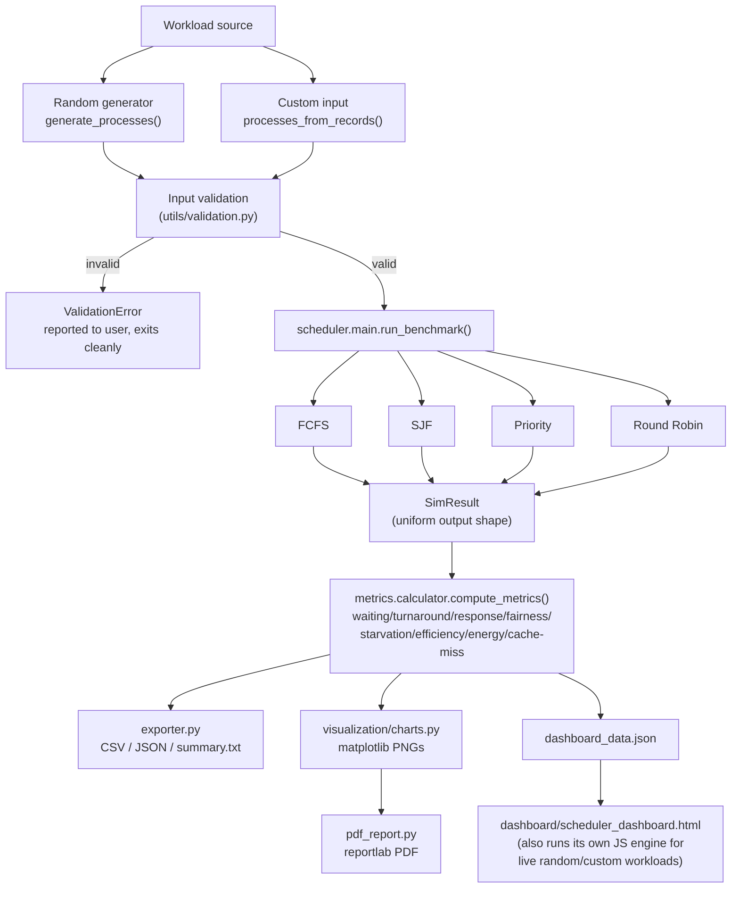
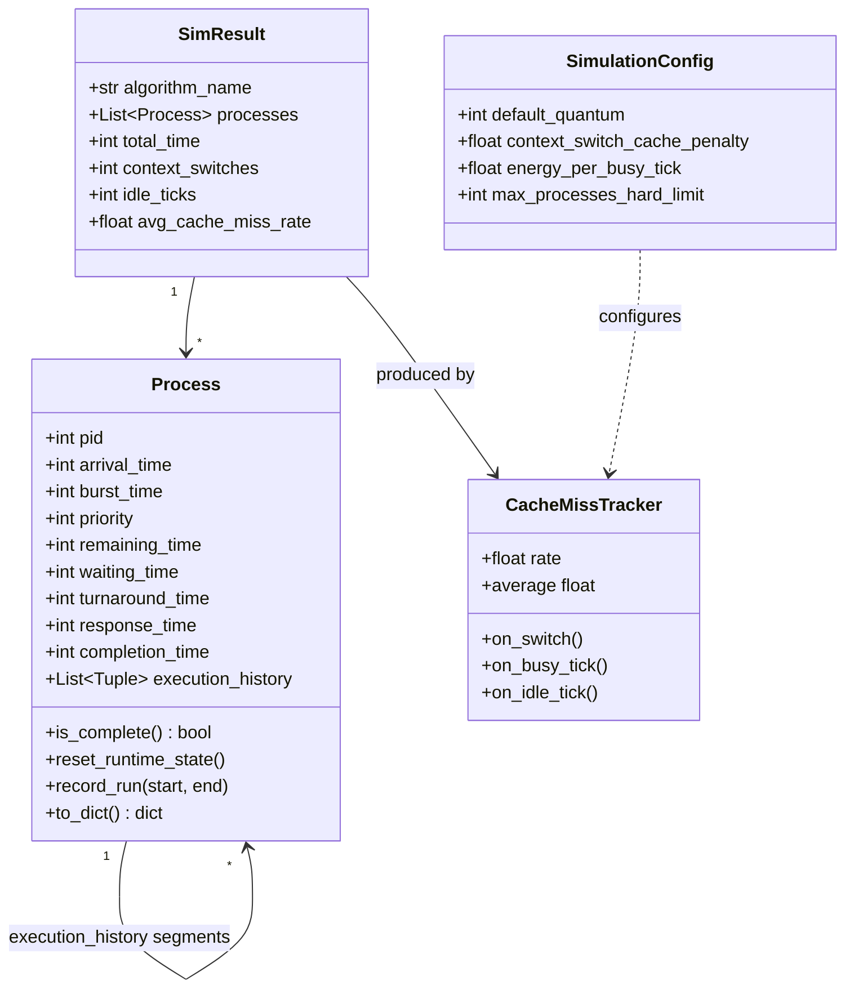
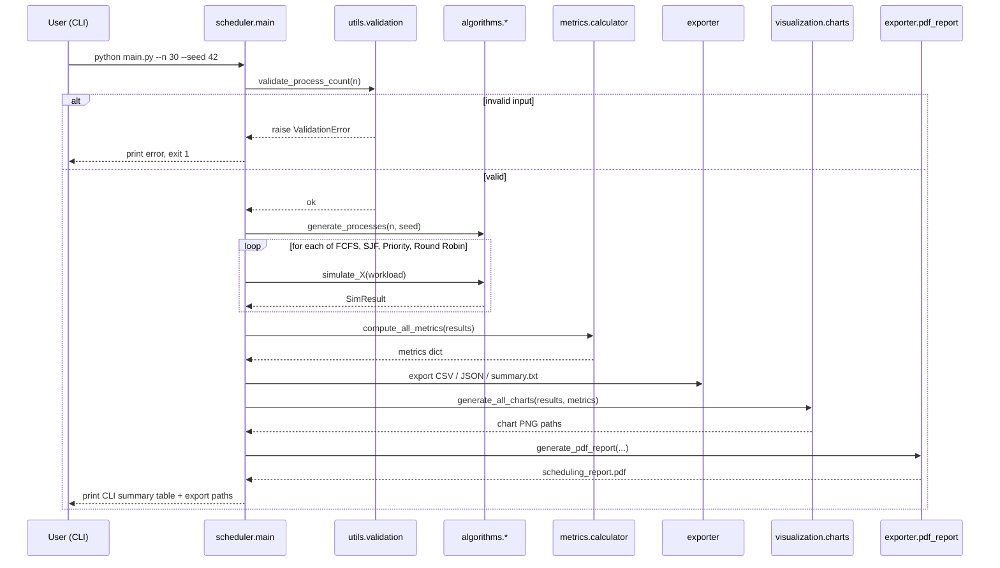

# Architecture

## Folder structure

```
cpu-scheduler/
├── main.py                        # thin entry point -> scheduler.main.main()
├── scheduler/
│   ├── main.py                     # orchestrator: load/generate workload, run
│   │                                #   benchmark, export everything
│   ├── algorithms/
│   │   ├── base.py                  # ready_queue(), CacheMissTracker, SimResult,
│   │   │                            #   empty_result() — shared by all 4 algorithms
│   │   ├── fcfs.py, sjf.py, priority.py, round_robin.py
│   ├── core/
│   │   └── process.py              # Process dataclass, generate_processes(),
│   │                                #   processes_from_records() (custom input)
│   ├── metrics/
│   │   └── calculator.py           # every metric formula, in one place
│   ├── visualization/
│   │   └── charts.py               # matplotlib chart generation (real data only)
│   ├── exporter/
│   │   ├── exporter.py             # CSV / JSON / text summary export
│   │   └── pdf_report.py           # reportlab PDF report, embeds real charts
│   ├── config/
│   │   └── settings.py             # ALL constants + enums, single source of truth
│   └── utils/
│       ├── validation.py           # input validation, raises ValidationError
│       └── logging_config.py
├── dashboard/
│   └── scheduler_dashboard.html    # self-contained interactive dashboard
├── tests/                          # unittest-based (pytest-compatible) test suite
├── docs/                           # this file, screenshots, etc.
├── data/                           # JSON exports
├── results/                        # CSV/PDF exports + results/charts/ PNGs
└── logs/                           # simulation.log
```

## System flow



## Class diagram (core simulation types)



## Sequence diagram (one benchmark run)



## Design notes

- **Every algorithm converges on `SimResult`** (`scheduler/algorithms/base.py`) so
  `metrics/calculator.py` has exactly one implementation of "average waiting
  time," "fairness index," etc. — never duplicated per algorithm.
- **The dashboard has its own JavaScript scheduling engine** that mirrors the
  Python algorithms line-for-line (same tie-break rules: `(metric,
  arrival_time, pid)`), verified against the same invariants the Python test
  suite checks (see `tests/`). This lets "Random Workload Generator" and
  "Custom Process Input" run instantly in the browser without a server
  round-trip, while `python main.py` remains the canonical, tested path for
  anything you'd cite in a report.
- **No ML/RL components anywhere in this project.** Four classical algorithms
  only, per project scope.
